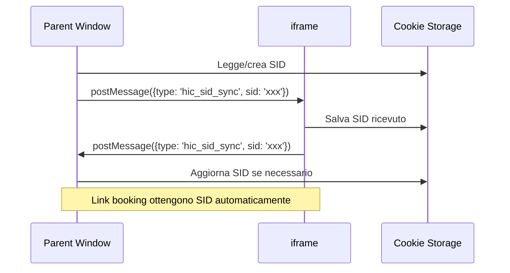

# Supporto iframe - Hotel in Cloud Monitoraggio Conversioni

> **Versione plugin:** 3.3.0 · **Autore:** Francesco Passeri — [francescopasseri.com](https://francescopasseri.com) — [info@francescopasseri.com](mailto:info@francescopasseri.com)


## Panoramica

**SÌ, il sistema gestisce completamente i sistemi di prenotazione Hotel in Cloud implementati in iframe.** 

Il plugin include funzionalità native per gestire scenari iframe, garantendo che il tracciamento delle conversioni e la sincronizzazione dei Session ID (SID) funzionino correttamente anche quando il sistema di prenotazione HIC è incorporato in un iframe.

## Funzionalità iframe implementate

### 1. Comunicazione cross-frame bidirezionale

Il plugin implementa un sistema di comunicazione sicura tra la finestra padre (parent) e l'iframe utilizzando l'API `postMessage`:

```javascript
// Nel parent: invia SID all'iframe quando viene caricato
if (window !== window.top) {
    try {
        window.parent.postMessage({
            type: 'hic_sid_sync',
            sid: sid
        }, '*');
    } catch(e) {
        // Cross-origin, non possiamo comunicare
    }
}

// Ascolta messaggi da iframe e sincronizza SID
window.addEventListener('message', function(event) {
    if (event.data && event.data.type === 'hic_sid_sync' && event.data.sid && isValidSid(event.data.sid)) {
        setCookie('hic_sid', event.data.sid, 90);
    }
});
```

### 2. Rilevamento automatico link dinamici

Il plugin utilizza `MutationObserver` per monitorare dinamicamente l'aggiunta di nuovi link di prenotazione, anche quelli caricati in iframe:

```javascript
var observer = new MutationObserver(function(mutations) {
    mutations.forEach(function(mutation) {
        if (mutation.type === 'childList') {
            mutation.addedNodes.forEach(function(node) {
                if (node.nodeType === 1) {
                    var newLinks = node.querySelectorAll('a.js-book, a[href*="booking.hotelincloud.com"]');
                    if (newLinks.length > 0) {
                        newLinks.forEach(addSidToLink);
                    }
                }
            });
        }
    });
});
```

### 3. Sincronizzazione SID automatica

- **Parent → iframe**: Quando un iframe viene caricato, riceve automaticamente il SID dal parent
- **iframe → Parent**: Se l'iframe genera o modifica un SID, viene sincronizzato con il parent
- **Persistenza**: I SID vengono salvati nei cookie con durata di 90 giorni
- **Validazione**: Ogni SID viene validato prima della sincronizzazione

## Scenari supportati

### Scenario 1: iframe incorporato in pagina WordPress
```html
<!-- Pagina WordPress -->
<div class="booking-container">
    <iframe src="https://booking.hotelincloud.com/widget/hotel-id" 
            width="100%" height="600"></iframe>
</div>
```
✅ **Supportato**: Il plugin sincronizza automaticamente il SID tra parent e iframe.

### Scenario 2: Widget di prenotazione dinamico
```html
<!-- Widget caricato dinamicamente via JavaScript -->
<script>
    // Widget che crea iframe dinamicamente
    loadBookingWidget({
        hotel: 'hotel-id',
        container: '#booking-widget'
    });
</script>
```
✅ **Supportato**: Il `MutationObserver` rileva nuovi iframe e applica la sincronizzazione SID.

### Scenario 3: iframe cross-origin
```html
<!-- iframe da dominio diverso -->
<iframe src="https://external-domain.com/booking-hic" 
        sandbox="allow-scripts allow-same-origin"></iframe>
```
⚠️ **Limitazioni**: Per iframe cross-origin con restrizioni, la comunicazione `postMessage` potrebbe essere limitata dalle policy di sicurezza del browser.

### Scenario 4: Multipli iframe nella stessa pagina
```html
<!-- Più iframe di prenotazione -->
<iframe id="rooms" src="https://booking.hotelincloud.com/rooms"></iframe>
<iframe id="offers" src="https://booking.hotelincloud.com/offers"></iframe>
```
✅ **Supportato**: Ogni iframe riceve e mantiene sincronizzato lo stesso SID.

## Selettori supportati

Il plugin rileva automaticamente i seguenti link di prenotazione:

1. **Classe CSS**: `a.js-book`
2. **URL contenente**: `booking.hotelincloud.com`

```html
<!-- Esempi di link rilevati automaticamente -->
<a href="https://booking.hotelincloud.com/hotel/123" class="js-book">Prenota ora</a>
<a href="https://booking.hotelincloud.com/widget/456">Prenotazione</a>
<a href="https://app.hotelincloud.com/booking/789" class="js-book">Book now</a>
```

## Validazione e sicurezza

### Validazione SID
```javascript
function isValidSid(sid) {
    return sid && typeof sid === 'string' && sid.length > 8 && sid.length < 256;
}
```

### Sicurezza cross-frame
- Utilizzo di `try-catch` per gestire errori cross-origin
- Validazione del formato dei messaggi `postMessage`
- Sanitizzazione dei dati prima del salvataggio nei cookie

## Flusso di sincronizzazione



## Test e debug

### 1. Verifica comunicazione iframe
```javascript
// Console del browser - verifica eventi postMessage
window.addEventListener('message', function(e) {
    if (e.data.type === 'hic_sid_sync') {
        console.log('SID sync:', e.data.sid);
    }
});
```

### 2. Controllo SID nei cookie
```javascript
// Console del browser
document.cookie.split(';').find(c => c.includes('hic_sid'));
```

### 3. Test link automatici
```javascript
// Verifica che i link abbiano il SID
document.querySelectorAll('a[href*="booking.hotelincloud.com"]')
    .forEach(link => console.log(link.href));
```

## Limitazioni note

1. **Cross-origin strict**: iframe con policy restrittive potrebbero bloccare `postMessage`
2. **Cookie SameSite**: Policy cookie restrictive potrebbero impedire la condivisione tra domini
3. **Adblocker**: Alcuni adblocker potrebbero interferire con script di tracciamento
4. **Timing**: La sincronizzazione avviene in modo asincrono, potrebbe esserci un breve ritardo

## Risoluzione problemi

### Problema: SID non sincronizzato in iframe
**Soluzione**: Verificare che:
- L'iframe non abbia restrizioni `sandbox` troppo severe
- Non ci siano errori JavaScript nella console
- I cookie non siano bloccati dal browser

### Problema: Link non ottengono SID automaticamente
**Soluzione**: Controllare che:
- I link abbiano classe `js-book` O URL contenga `booking.hotelincloud.com`
- Il `MutationObserver` sia attivo (supportato dai browser moderni)
- Non ci siano conflitti con altri script

### Problema: Iframe cross-domain non comunica
**Soluzione**: 
- Verificare policy CORS del server iframe
- Considerare implementazione alternativa via URL parameters
- Consultare documentazione specifica del provider iframe

## Conclusione

Il plugin **supporta completamente** i sistemi di prenotazione Hotel in Cloud in iframe, con:
- ✅ Sincronizzazione automatica SID bidirezionale
- ✅ Rilevamento dinamico link di prenotazione
- ✅ Supporto iframe multipli
- ✅ Gestione errori cross-origin
- ✅ Persistenza cookie a lungo termine

La funzionalità è attiva di default e non richiede configurazioni aggiuntive.
